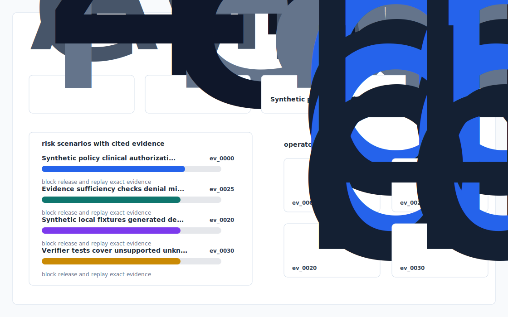

# Prior Authorization Evidence Court


A local healthcare workflow prototype for assembling synthetic prior-authorization evidence packs and validating claim support.

`priorauth-evidence-court` favors explicit fixtures, deterministic checks, and reviewable artifacts over hidden services or live data.

## Use case

Prior Authorization Evidence Court: Medical-Necessity Decisions With Source-Level Proof.

## Signal design

- Synthetic policy, clinical, and authorization-case fixtures with no PHI.
- Evidence sufficiency checks for denial risk, missing documents, and policy alignment.
- Verifier-backed decision reports and an offline review dashboard.

## Demo path

```bash
uv sync
uv run app init-demo
uv run app ingest fixtures/
uv run app analyze
uv run app verify
uv run app dashboard
uv run app benchmark
uv run app export-demo-pack
uv run pytest -q
uv run ruff check .
```

## Files worth opening

- `outputs/dashboard.html`
- `outputs/decision_report.md`
- `outputs/evidence_graph.mmd`
- `outputs/risk_or_quality_report.csv`
- `outputs/benchmark.md`
- `outputs/demo_pack.md`

## Build checks

```bash
uv run ruff check .
uv run pytest -q
uv run app verify
```

## Data policy

`Prior Authorization Evidence Court` checks in synthetic fixtures only. Runtime state, dashboards, caches, virtual environments, and generated packs stay out of git.


